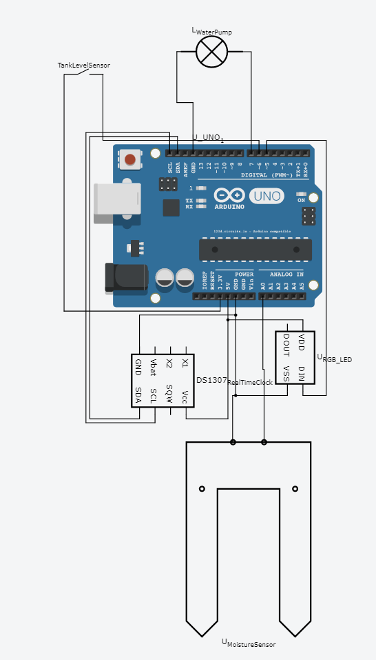

Water Me - Plant Water Management System
========================================

## Components

* DS1307 - Real Time Clock
* 3V/5V Water pump
* WS2812B RGB LED
* Capacitive Moisture Sensor
* Water Level Sensor
* Arduino Uno
* Water Tank
* Silicone tubing
* Electronics Case

## Wiring

## Description

The System checks the moisture regularly and if the value reaches a threshold it starts a watering process. This is done in cycles where each cycle administers some water then waits for the water to spread check moisture level and if needed continues to administer water. If the cycles take to long to properly moisturize the soil the process is aborted and will be restarted if by the next check the moisture level didn't improve.

If at any time the tank reaches critical level the System will stop checking moisture level and cancel any watering process until the tank is refilled.

## Configuration

### PIXEL_PIN
The digital pin that connects to the WS2812B RGB LED.

*Default: 5*

### MOISTURE_SENSOR_PIN
The Analog pin that connects to the Moisture Sensor.

*Default: A0*

### TANK_LEVEL_SENSOR_PIN
The digital pin that connects to the water level sensor.

*Default: 6*

### VALVE_PIN
The digital pin that connects to the water pump.

*Default: 7*

### CHECK_INTERVAL
The interval in which the system checks the moisture level and administers water if threshold is reached.

*Default: TimeSpan(0, 0, 1, 0) -> 1 min*

### WATER_SPREAD_DELAY
The amount of delay the system waits in between watering cycles.

*Default: 5000ms*

### WATERING_AMOUNT_TIME
The duration the Pump is activated (valve is opened) per watering cycle.

*Default: 1000ms*

### SCHEDULING_DELAY
The delay the system pauses after a scheduled check.

*Default: 500ms*

### EMPTY_TANK_CHECK_INTERVAL
The interval the system checks the tank level when critical.

*Default: 3000ms*

### MAX_WATERING_CYCLES
The maximum number of watering cycles before the system waits for the next scheduled check.

*Default: 10*

### MOISTURE_LEVEL_THRESHOLD
The threshold of moisture level the soil has to fall below to trigger a watering process.

*Default: 0.5*

### MOISTURE_BASE_OFFSET
The base offset of the moisture sensor value.

*Default: -250.0*

### MOISTURE_SCALE_FACTOR
The scaling factor of the moisture sensor value.

*Default: 1/300.0*
